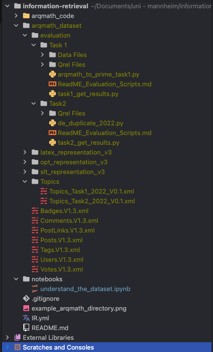

# Uni Mannheim information retrieval project

To get a better understanding of the tasks and the dataset you can look at the following papers and documents:

- https://www.cs.rit.edu/~dprl/ARQMath/arqmath-resources.html
- https://www.cs.rit.edu/~rlaz/files/ARQMath_2022_Overview_WorkingNotes.pdf
- http://ceur-ws.org/Vol-2936/paper-01.pdf
- https://link.springer.com/content/pdf/10.1007/978-3-030-99739-7.pdf (page 408-414)
- The README_DATA.md is helpful to get a better understanding of the concrete dataset structure (also see the class
  diagram)

Current state of understanding:

- We don't need to install the LaTeXML tool since we don't have to preprocess the dataset. The LaTeXML tool is only
  needed to scrape the comments from the MathStackExchange snapshot. Therefore, the only thing you need to install
  is the prepared conda environment (more dependencies will be added in the future)
- You can download the ARQMath dataset from the google drive
  folder (https://drive.google.com/drive/folders/1YekTVvfmYKZ8I5uiUMbs21G2mKwF9IAm). Copy the files to
  the `arqmath_dataset` directory as shown in the screenshot. The concrete directory structure may change in the
  future 
- In the `understand_the_dataset` jupyter notebook I tried to read and print the dataset. Currently, only the memory
  address is printed (don't know why, further investigation needed). However, it worked to generate html
  pages (see html_pages directory). The code used to read the dataset is copied from the ARQMath GitHub
  repo (https://github.com/ARQMath/ARQMathCode).
- Next steps: Try to print some posts and questions

Open questions for the coaching session (feel free to add questions if you have any):

- Can we use libraries that have already implemented concrete functions that are used in information retrieval models (
  e.g. scikit-learn TfidfVectorizer) or should we implement all of them ourselves?
- What is about PyTerrier as this is an information retrieval framework and provides a lot of ready-to-use information
  retrieval models. I think it's still difficult to get everything working due to the complex dataset.
- Do we need a frontend or cli? I hope not and would prefer to use jupyter notebooks as a kind of frontend to run
  retrieval models. 
